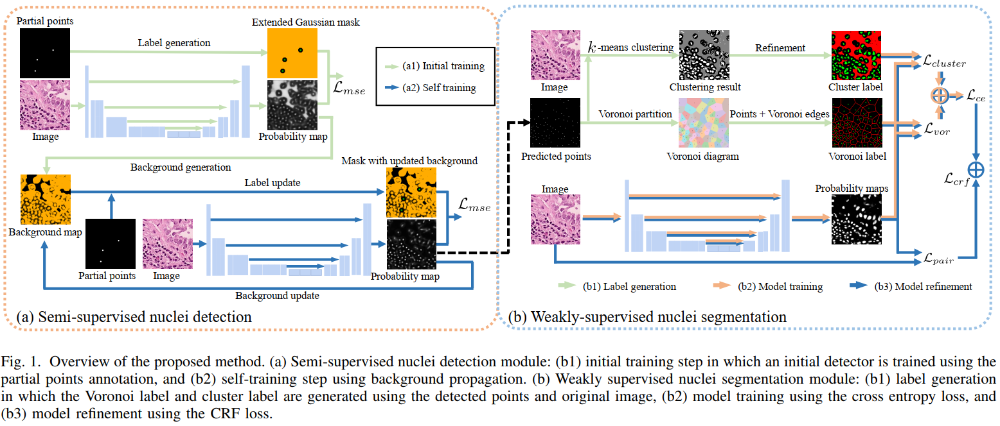

# Weakly Supervised Nuclei Segmentation using Partial Points Annotation
## Description
This repository contains the Pytorch code for the paper:

Weakly Supervised Deep Nuclei Segmentation using Partial Points Annotation in Histopathology Images, TMI2020. (PDF)

If you find this code helpful, please cite our work:

```
@artcle{Qu2020weakly,
    author = "Qu, Hui and Wu, Pengxiang and Huang, Qiaoying and Yi, Jingru and Yan, Zhennan and Li, Kang 
            and Riedlinger, Gregory and De, Subhajyoti and Zhang, Shaoting and Metaxas, Dimitris",
    title = "Weakly Supervised Deep Nuclei Segmentation Using Partial Points Annotation in Histopathology Images",
    journal = "IEEE transactions on Medical Imaging",
    year = "2020",
}
```

## Introduction

Nuclei segmentation is a fundamental task in histopathology image analysis. Typically, such segmentation tasks
require significant effort to manually generate accurate pixelwise annotation for fully supervised training. 
To alleviate such tedious and manual effort, in this paper we propose a novel weakly supervised segmentation 
framework based on partial points annotation, i.e., only a small portion of nuclei locations in each image are 
labeled. The framework consists of two learning stages. In the first stage, we design a semi-supervised strategy 
to learn a detection model from partially labeled nuclei locations. Specifically, an extended Gaussian mask is
designed to train an initial model with partially labeled data. Then, self-training with background propagation 
is proposed to make use of the unlabeled regions to boost nuclei detection and suppress false positives. In the 
second stage, a segmentation model is trained from the detected nuclei locations in a weakly-supervised fashion. 
Two types of coarse labels with complementary information are derived from the detected points and are then 
utilized to train a deep neural network. The fully-connected conditional random field loss is utilized in training 
to further refine the model without introducing extra computational complexity during inference. The proposed 
method is extensively evaluated on two nuclei segmentation datasets. The experimental results reveal that our 
method can achieve competitive performance compared to the fully supervised counterpart and the state-of-the-art 
methods while requiring significantly less annotation effort.



## Dependencies
Ubuntu 16.04

Pytorch 1.0.0

Gcc >= 4.9


## Usage
### Build CRFLoss
GCC version >= 4.9 is required to build the CRF loss correctly.
```bash
cd ./code_seg/crf_loss
python setup.py install
```
### Train and test
* Put the original images in the folder *./data/MO/images*放原图 and instance labels in the folder *./data/MO/labels_instance*放mask,名字后面带上*_labels*
* 在 *./data/MO/labels_point*里面放用mask生成的点图,名字后面带上 *_label_point*
* Specify the image names of train, val, test sets in the json file under *./data/MO*
* Set the training parameters in ```code_detection/options.py``` and ```code_seg/options.py```
* Run the script ```run.sh``` for detection and segmentation
